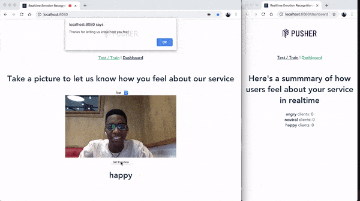

# Realtime Emotion Recognition Application with Pusher + Tensorflow.js + Vue

This repository shows how to build a realtime emotion recognintion application that updates a dashboard with the recognized emotions in realtime.



Link to [Tutorial](https://pusher.com/tutorials/emotion-recognition-tensorflow)

## Prerequisites

- [Node](https://nodejs.org) version 8.9 or greater
- [Yarn](https://yarnpkg.com)

## Getting Started

### Install the node modules

```
yarn install
```

### Run frontend application

```
yarn serve
```

### Run the backend server

```
cd server
yarn install
yarn start
```

## Training and Testing

Have a browser tab open on `http://localhost:8080/` and another tab open on `http://localhost:8080/dashboard` to see your results in realtime

## Built with

- [Pusher](https://pusher.com/) - APIs to enable devs building realtime features
- [Tensorflow.js](https://js.tensorflow.org) - A JavaScript library for training and deploying ML models in the browser and on Node.js
- [Vue](https://vuejs.org) - A Javascript framework for building interactive interfaces
